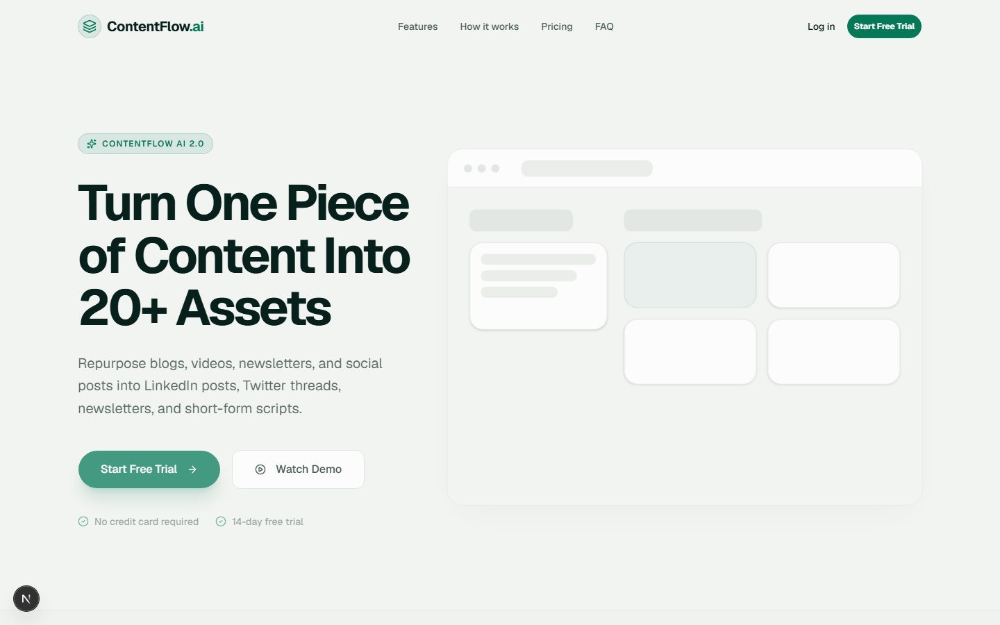
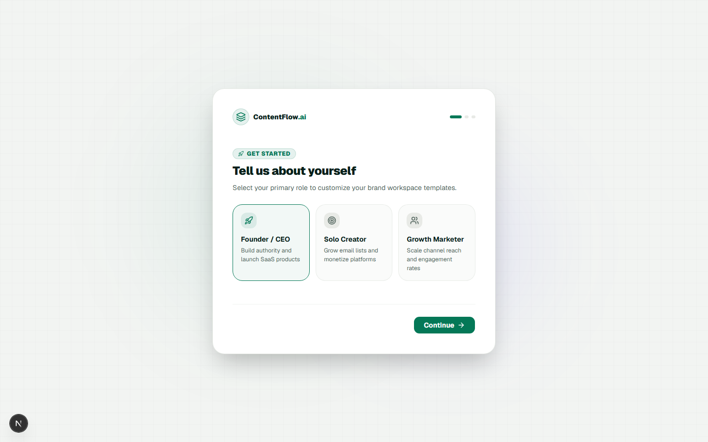

# ContentFlow AI
> **Turn One Piece of Content Into Dozens**

ContentFlow AI is a premium, portfolio-grade AI content repurposing platform built to look like a funded startup. It allows users to convert blog posts, videos, podcasts, and newsletters into dozens of ready-to-publish social assets (LinkedIn posts, Twitter threads, newsletters, and short-form video scripts) in seconds.

### 🌐 Website Landing Page


### 📊 Platform Dashboard


---

## ✨ Features

### 1. Conversion-Optimized Landing Page
* **Modern Hero**: A premium dark-mode landing layout with purple/blue glowing gradients and Framer Motion entrance animations.
* **Feature Bento Grid**: Showcases the core capabilities of the platform with interactive hover highlights.
* **Pricing & FAQs**: Features transparent pricing plans and an interactive accordion for common inquiries.

### 2. Comprehensive Analytics Dashboard
* **KPI Overview**: Displays critical growth indicators (total impressions, click rate, generation count, active workspace members) with visual trend indicators.
* **Activity & Engagement Tracking**: Beautiful custom `Recharts` visualizations (Area and Bar charts) tracking content performance.
* **Recent Activity Feed**: Real-time mock log of content generations, workspace changes, and export events.

### 3. Split-Pane AI Generator
* **Interactive Panel**: Upload blogs or enter text, select custom brand voice profiles, and watch realistic loading states process the input.
* **Multi-Platform Outputs**: Formatted outputs generated simultaneously across 4 tabs:
  * **LinkedIn**: Single post with call-to-actions.
  * **Twitter**: Formatted, readable thread drafts.
  * **Newsletter**: Long-form structured summary drafts.
  * **Video Script**: Structured TikTok/Reels/Shorts script with scene descriptions.

### 4. Robust Content Library
* Searchable and filterable data table with status indicators (Draft, Scheduled, Published), platforms, and quick action dropdowns.
* Generates 50+ rich mock database entries for real-world testing.

### 5. Multi-Member Workspaces & Billing
* Full workspace management (invite members, assign roles, manage profiles).
* Dedicated billing dashboard containing mock plan details, usage tracking cards, and past invoices.

### 6. Interactive Content Pipeline (Kanban Board)
* **Trello-style Drag and Drop**: High-performance, butter-smooth card movement between status columns with real-time coordinate tracking and dynamic, zero-jump container placeholders.
* **Custom Workflow Groups**: Create, delete, or customize workflow columns with various color accents (Slate, Purple, Pink, Orange, Teal) to track specialized stages.


---

## 🛠️ Tech Stack

* **Core**: Next.js 16 (App Router, Turbopack) & React 19
* **Styling**: Tailwind CSS v4 & Vanilla CSS
* **Components**: `@base-ui/react` / shadcn/ui
* **Animations**: Framer Motion
* **Charts**: Recharts
* **Language**: TypeScript

---

## 🚀 Getting Started

Follow these steps to run the project locally.

### 1. Clone the repository
```bash
git clone https://github.com/ArnavNah/Content-Flow.git
cd Content-Flow
```

### 2. Install dependencies
```bash
npm install
```

### 3. Run the development server
```bash
npm run dev
```

Open [http://localhost:3000](http://localhost:3000) with your browser to see the result.

---

## 📂 Project Structure

```
├── public/                # Static assets & screenshots
├── src/
│   ├── app/               # Next.js App Router (Layouts & Pages)
│   │   ├── dashboard/     # Platform Views (Analytics, Generator, Library, Settings)
│   │   ├── login/         # Auth pages
│   │   ├── signup/        # Sign up views
│   │   └── page.tsx       # Landing Page
│   ├── components/        # Shared components
│   │   ├── dashboard/     # Dashboard specific views
│   │   ├── landing/       # Landing page sections
│   │   └── ui/            # Base UI primitives (Button, Dropdown, Input, etc.)
│   └── lib/               # Utility functions (cn, utils)
```

Enjoy using ContentFlow AI! 🚀
